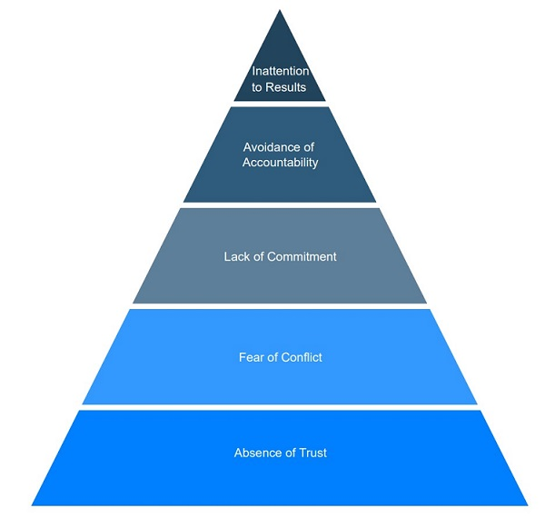

# 5 Dysfunctions of a Team

"5 Dysfunctions of a Team" is created by Patrick Lencioni for teams to perform better together.
Like Maslow's "Hierachy of Needs" is takes a form of a pyramid which and the concept that you cannot resolve the issues of a higher level without attending to the lower level needs first.

Each dysfunction has a direct impact on a team’s performance and smaller overall productivity.

## Sources

- [5 Dysfunctions of a Team](https://high5test.com/5-dysfunctions-of-a-team-what-they-are-and-how-to-overcome/)
