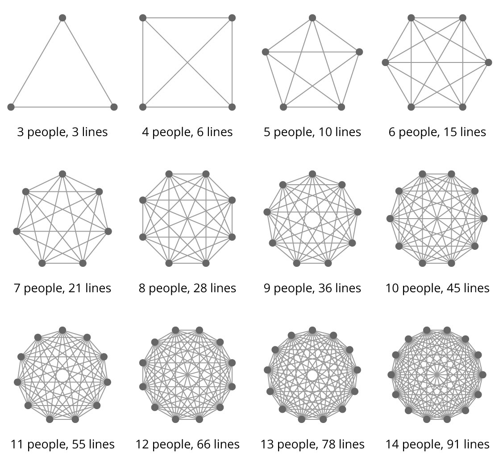

# Brook's law

## General information
Brooks’s Law: ”adding human resources to a late software project makes it later”

The lines of communication is one intermediate step that leads to something adding more people to a late project makes it later.

## Representation of the mental model
Most teams in large enterprises have between 10 and 20 members. 
Even at the low end of that scale, a team has so many lines of communication that progress is bound to be slow.

Adding more people to a highly divisible task, such as cleaning rooms in a hotel, decreases the overall task duration (up to the point where additional workers get in each other's way). However, other tasks including many specialties in software projects are less divisible. Brooks points out this limited divisibility with another example:

>  While it takes one woman nine months to make one baby, "nine women can't make a baby in one month".

**Overstaffed** \
Maybe the tasks aren’t really parallelizable, which means the organization incurs increased coordination overhead through meetings?

**Technical Debt and Code Health** \
Could it be that the organization has taken on excess technical debt that is now hurting the progress?

**On-Boarding Costs** \
Maybe the project is indeed appropriately staffed, but the decline in output is due to accumulated on-boarding costs?

### Sources
1. [Brooks law - CodeScene](https://codescene.com/blog/visualize-brooks-law/)
2. [Applying Brooks' Law to Lines of Communication - DZone](https://dzone.com/articles/applying-brooks-law-to-lines-of-communication-and)
3. [Mythical Man Month: Why More Manpower Doesn’t Mean Faster Work](https://www.youtube.com/watch?v=Xsd7rJMmZHg)
