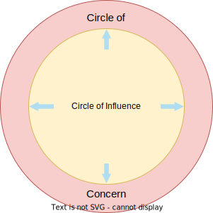

# Circle of Influence
---
> Circle of influence refers to the area of your life where you can actually make changes. It is that circle of your life where you focus your energy to become your best version. It also helps to regain your control of important things.

> Method to structurize work and regain control. You collect everything of concern and then evaluate if you can control or influence them.

## Reactive Focus
Negative Energy Reduces Circle of Influence

## Proactive Focus
Positive energy enlarges Circle of Influence

# Criteria
---

- The mental model is explained in our adapted one-pager format
- It contains text and an explaining image
- It's in our GitHub project
- At least one content-wise review cycle is done within the team
- It's published on GitHub Pages

# Sources
---

GitHub Stuff:
https://github.com/orgs/dhbw-ka-pm/projects/1/views/1

Link : 
https://www.youtube.com/watch?v=uj8dmSgQa1c&t=90s
https://www.abrahampc.com/blog/2020/3/16/what-can-i-do-the-circles-of-concern-and-influence