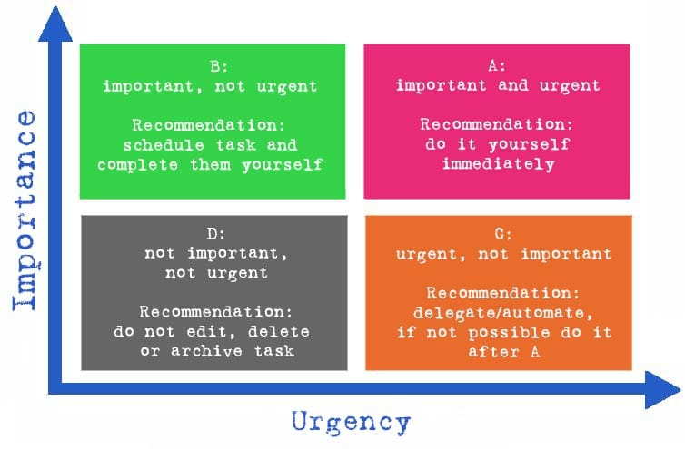

# Eisenhower Matrix

## What is the Eisenhower Matrix?

The Eisenhower Matrix is a method to improve your timemanagement and structure your tasks. For that you use the criteria of importance and urgency. You can see how that is done in the following diagram:

## Aim of the Eisenhower Matrix

The aim of creating the Eisenhower Matrix is to sort tasks according to their **importance** and **urgency**.  
It is a useful tool for increasing **effectiveness** and not for increasing efficiency.

Sort and prioritise your tasks by:

1. **Importance**
2. **Urgency**

Then split the Matrix into the four categories:

- **A: important & urgent** 🟣
- **B: important & not urgent** 🟢
- **C: not important & urgent** 🟠
- **D: not important & not urgent** ⚫

## Disadvantages of the Eisenhower Matrix

The Eisenhower principle sounds simple in theory, but in practice there are always challenges:

- often new tasks are constantly being created, so the time planning doesn't always work well
- Depending on the perspective and context, the tasks can be listed different
- Not everyone likes to work in a synchronized, 100% structured way
- Short, urgent tasks are left behind, even if their checking off the list helps with productivity
- The use of the matrix on a daily basis can time-consuming

## Sources

- [t2informatik - Eisenhower Matrix](https://t2informatik.de/en/smartpedia/eisenhower-matrix/)
