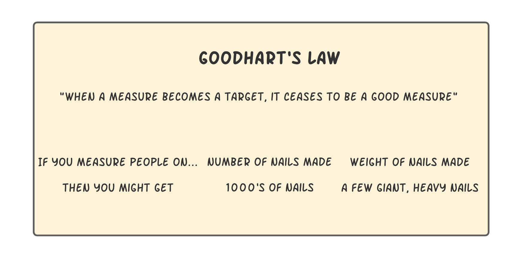

# Goodhart's Law

Observers tend to change their behavior artificially to reach a target without caring about the reason for the measure. They'll try to manipulate. The law was originally stated as:

> "Any observed statistical regularity will tend to collapse once pressure is placed upon it for control purposes."

### Examples

Google's PageRank algorithm would rank websites based on the number of incoming links from other websites. This led to webmasters gaming the system by artificially increasing the number of links to their website.

A company requiring writers to write a specific number of words a day will probably produce low quality, filler content as writers try to meet their quota.

### Sources
1. [Mental Models Box](https://www.mentalmodelsbox.com/model/goodharts-law)
2. [Sketchplanations](https://sketchplanations.com/goodharts-law)