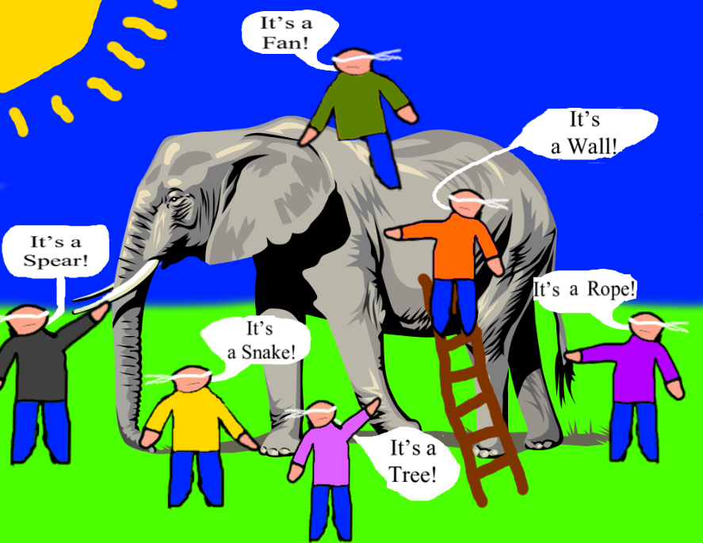

# The blind men & an elephant

## Summary
In the folk tale "The Blind Men and the Elephant", a group of blind men or men in complete darkness examine an elephant to understand what the animal is.
Each man examines a different part of the elephants body. Later they compare their examinations to each other and find out that everyone has a different point of view:

- The first man thinks it is a wall(elephants body).
- The second man thinks it is a spear(elephants tusk).
- The third man thinks it is a snake(elephants trunk).
- The fourth man thinks it is a tree(elephants knee).
- The fifth man thinks it is a fan(elephants ear).
- The sixth man thinks it is a rope(elephants tail).

-> The folk tale shows that reality can be understood differently depending on the perspective.

## Origin 
- not clear where the correct origin is from but its most likely from the south of asia.
- The parable was used in many beliefs. Because of that there developed some variants of the original parable.
  - the beliefs where Sufism, Jainism, Buddhism, or Hinduism
- The variants of the parable are only differ in some little parts like:
  - the count of men
  - the way they describe the parts of the elephant
  - the way the discussion takes part
  - weather the conflict will be solved

## Moral / what we can learn 
- The "elephant" in this story can stand for all kinds of things that we cannot properly assess.
- We all have a limited or simply different perspective on these things through our previous experiences.
- With our senses we often can't assess or interpret all information correctly. So they often do not show the reality, but our estimation
- There is often not one perspective. Several or all perspectives, however different, can be correct.
- If we assume that only our perspective is correct, we find it difficult to work with others.
- But we can also make use of our diversity by uniting the different perspectives.

### Sources
1. [The Blind Man and the Elephant: A Short Story about Perspective](https://www.sloww.co/blind-men-elephant/)
2. [The Blind Man and the Elephant](https://www.peacecorps.gov/educators/resources/story-blind-men-and-elephant/)
3. [Wikipedia](https://de.wikipedia.org/wiki/Die_blinden_M%C3%A4nner_und_der_Elefant)
