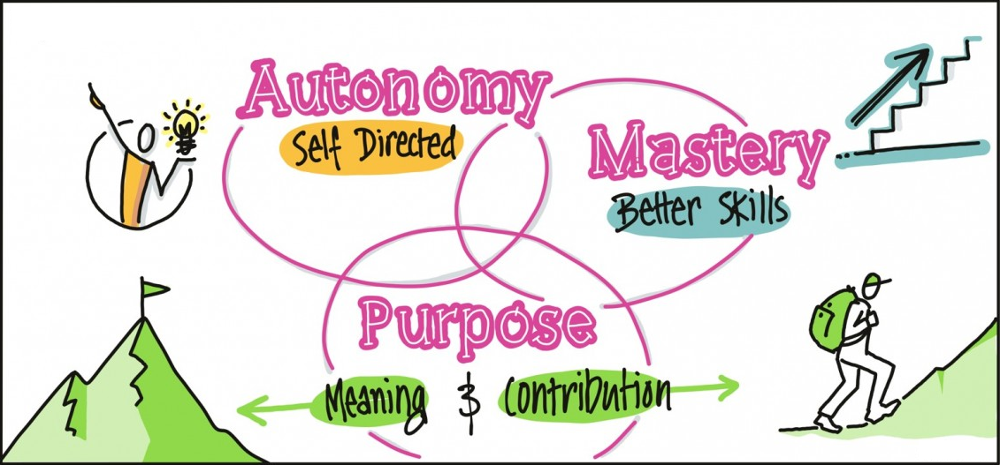

# What drives us - Autonomy, Mastery, Purpose

## **Introduktion**

The mental model "What drives us is based on the book written by Daniel Pink. It argues that human motivation is largely intrinsic, and that the aspects of this motivation can be divided into autonomy, mastery, and purpose.

## **Autonomy**

Autonomy  is the need to direct your own life and work. To be fully motivated, you must be able to control what you do, when you do it, and who you do it with.

Autonomy motivates us to think creatively  without needing to conform to strict workplace rules. By rethinking traditional ideas of control (regular office hours, dress codes, ...) organizations can increase staff autonomy, build trust, and improve creativity.

## **Mastery**

Mastery is the desire to improve. If you're motivated by mastery, you'll likely see your potential as being unlimited, and you'll constantly seek to improve your skills through learning and practice. Someone who seeks mastery needs to attain it for its own sake.

## **Purpose**

People may become disengaged and demotivated at work if they don't understand, or can't invest in, the "bigger picture."

But those who believe that they're working toward something larger and more important than themselves are often the most hardworking, productive and engaged.

---

### Source

[www.mindtools.com](https://www.mindtools.com/pages/article/autonomy-mastery-purpose.htm#:~:text=To%20build%20an%20intrinsically%20motivated%20team%2C%20you%20need%20to%20focus,continue%20to%20improve%20their%20skills.)\
[www.wikipedia.org](https://en.wikipedia.org/wiki/Drive:_The_Surprising_Truth_About_What_Motivates_Us)
\
[www.corperate-rebels.com](https://corporate-rebels.com/dan-pink/)
\
[www.sketchplanations.com](https://sketchplanations.com/autonomy-mastery-purpose)